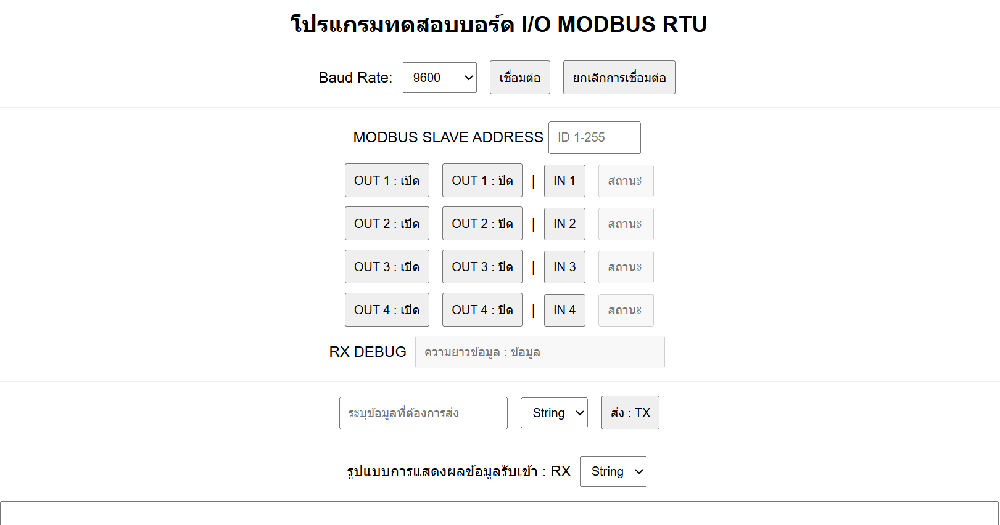
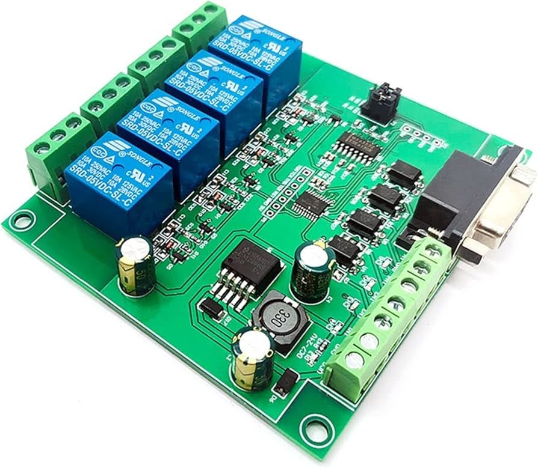

# Modbus-RTU-io-Board-Tester-via-Web-Serial-API

## รายละเอียด
โปรแกรมสำหรับทดสอบการสื่อสารกับบอร์ด I/O ผ่านโปรโตคอล MODBUS RTU โดยรองรับการเชื่อมต่อผ่าน RS232 และ RS485 โดยสามารถควบคุมการเปิด/ปิด Output และอ่านสถานะ Input ของบอร์ดใช้งานผ่าน web browser

## คุณสมบัติหลัก
- รองรับการเลือก Baud Rate (9600, 115200, 57600, 38400,etc)
- ควบคุม Output 1-4 (เปิด/ปิด)
- อ่านค่าจาก Input 1-4
- มีส่วนของเครื่องมือในการส่งคำสั่งเพิ่มเติมเลือกรูปการส่งได้ทั้งข้อความแบบปกติและแบบฐาน16(HEX)
- ส่งข้อมูลไปยังบอร์ดผ่าน Serial Port
- ตรวจสอบและคำนวณค่า CRC16 Modbus

## วิธีติดตั้งและใช้งาน
### 1. เปิดใช้งานบนเว็บเบราว์เซอร์
โปรแกรมนี้สามารถใช้งานได้บน Google Chrome หรือ Microsoft Edge ที่รองรับ Web Serial API

### 2. เชื่อมต่ออุปกรณ์
- เลือก Baud Rate ที่เหมาะสม
- กดปุ่ม "เชื่อมต่อ" เพื่อเริ่มการเชื่อมต่อ

### 3. ควบคุมและรับค่าจากบอร์ด
- กรอก MODBUS SLAVE ADDRESS
- ใช้ปุ่มเพื่อเปิด/ปิด Output และอ่านค่า Input
- สามารถดูค่าที่รับเข้ามาได้จาก RX Debug

### 4. ยกเลิกการเชื่อมต่อ
- กดปุ่ม "ยกเลิกการเชื่อมต่อ" เมื่อใช้งานเสร็จสิ้น

## ไฟล์ที่เกี่ยวข้อง
- `index.html` - ไฟล์หลักของเว็บแอปพลิเคชัน

## คำแนะนำเพิ่มเติม
- ตรวจสอบว่าคุณให้สิทธิ์การเข้าถึง Serial Port กับเบราว์เซอร์
- หากพบปัญหาเกี่ยวกับการเชื่อมต่อ ลองเปลี่ยนพอร์ต USB หรือใช้ตัวแปลง RS485/RS232 ที่รองรับ

## ผู้พัฒนา
[Chawanwit Poolsri](https://www.facebook.com/godda.binahead)

